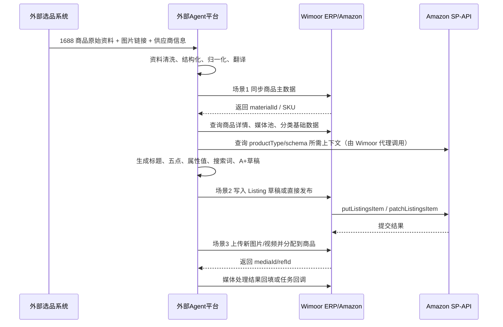

# 13. 商品开发到 Amazon Listing 的 Agent 对接方案

> 版本：v1.0  日期：2026-05-29

## 1. 文档目标

本文回答 4 个问题：

1. 外部选品系统如何把 1688 选品资料同步到 Wimoor 商品主数据。
2. 外部 Agent 如何基于 Wimoor 商品主数据生成 Amazon Listing 资料并发布。
3. 外部图片/视频 Agent 如何与 Wimoor 媒体库对接，并满足“新增不替换”的要求。
4. 当前系统如果没有专门面向外部系统的标准 API，应如何低风险落地。

本文只讨论当前仓库里已经存在的接口、字段与能力，以及为 Agent 能力补齐的建议接口层。不把仓库里零散的内部前端接口直接等同于成熟的外部开放接口。

## 2. 先给结论

当前系统已经具备 3 条可复用的底座：

1. ERP 商品主数据聚合保存能力：核心入口是 /erp/api/v1/material/saveData，对应 MaterialInfoVO 聚合模型。
2. Amazon Listing 发布能力：核心入口是 /amazon/api/v1/report/product/listing/putListingsItem，对应 Amazon SP-API 的 Listings Item 发布模型。
3. 商品媒体资源管理能力：核心入口是 /erp/api/v1/material/media/*，已支持媒体上传、池化、分配、排序、主图设置与 Amazon 媒体导入。

但当前系统也有 5 个明显缺口：

1. 商品主数据入口偏前端表单化，现有标准保存是 multipart + infostr，不是外部系统友好的 JSON upsert 接口。
2. Material 保存是“聚合覆盖式”语义，供应商、报关、标签、组装、耗材等从表会按最新快照重写，不适合外部系统只传局部 patch。
3. Listing 文案生成、草稿保存、审核、回填没有专门的 Agent 对接层，现有 putListingsItem 更接近“直接发布到 Amazon”。
4. A+ 内容相关的 Amazon SP-API SDK 已经在仓库里存在，但业务层没有现成 controller/service 对外封装，当前不能直接拿来做 A+ 发布链路。
5. 媒体 AI 回调接口 /erp/api/v1/material/media/processCallback 目前只是预留占位，没有完整任务创建、签名校验、结果落库逻辑。

因此，推荐的实施原则是：

- 第一步复用现有接口，先打通商品主数据、Listing 发布、媒体上传/分配的主链路。
- 第二步新增一层 Agent facade API，把外部系统需要的幂等、批量、草稿、回调、签名校验集中放到 facade，而不是直接改老 controller 契约。
- 第三步再补 A+、任务编排、异步回调和外部主键映射等能力。

## 3. 当前系统真实边界

### 3.1 调用入口

外部系统如果走 Gateway，对接路径应使用：

- /erp/api/v1/...
- /amazon/api/v1/...

当前系统登录态主要使用 jsessionid，不是 Bearer Token。也就是说，如果直接调用现有内部接口，外部系统默认需要先复用现有登录流程，或者在网关前再包一层新的 Agent 对接网关。

### 3.2 返回值风格

本文涉及的这些 ERP/Amazon 接口主要返回：

```json
{
  "code": 200,
  "msg": "操作成功",
  "data": {}
}
```

### 3.3 1688 相关入口的定位

仓库里存在 /api/v1/open1688 代理入口，但它本质上是 1688 代理/鉴权/HTTP 转发工具，不是商品主数据标准写入接口。不要把它当作“1688 选品结果同步到 Wimoor 商品资料”的正式主链路。

### 3.4 一条完整主链建议



## 4. 场景一：外部选品系统把 1688 资料同步到商品主数据

### 4.1 当前可直接复用的接口

| 用途 | 方法 | 路径 | 当前是否适合外部直接调用 | 说明 |
|---|---|---|---|---|
| 商品分页查询 | POST | /erp/api/v1/material/list | 可复用，但偏内部查询 DTO | 用于排重、查找已有 SKU |
| 根据 SKU 查商品 ID | GET | /erp/api/v1/material/getIdByMSku | 可复用 | 适合同步前幂等检查 |
| 根据商品 ID 查聚合详情 | GET | /erp/api/v1/material/getMaterialInfo | 可复用 | 返回 MaterialInfoVO 聚合结果 |
| 根据 SKU 批量查尺寸等 | POST | /erp/api/v1/material/getMaterialBySKU/{shopid} | 可复用 | 更适合批量补充读取 |
| 聚合保存商品资料 | POST | /erp/api/v1/material/saveData | 可复用，但不够开放友好 | multipart/form-data，内部表单式保存 |
| 基础信息 Excel 导入 | POST | /erp/api/v1/material/uploadBaseInfoFile | 可复用，但不推荐作为系统对系统主链路 | 更适合人工批量导入 |
| 保存报关资料 | POST | /erp/api/v1/material/saveCustoms | 可复用 | 可作为局部报关补录接口 |
| Amazon 反向补主档 | GET | /amazon/api/v1/report/product/productInOpt/syncProductList | 仅兜底，不应作为主链路 | 从平台商品回灌 ERP 主档 |

### 4.2 现有标准写入接口的调用方式

当前标准商品保存接口为：

- POST /erp/api/v1/material/saveData
- Content-Type: multipart/form-data
- 表单字段：
  - infostr: 字符串，内容为 MaterialInfoVO 的 JSON
  - file: 主图文件，可空
  - pkgfile: 包装图文件，可空

注意 3 个限制：

1. 这个接口只能顺带接收一张主图 file 和一张包装图 pkgfile，不能一次性接收完整图片集或视频集。
2. 该接口内部调用 saveAllInfo，属于整包覆盖式保存。供应商、标签、报关、组装、耗材等明细，应由外部系统传完整快照，而不是只传变更项。
3. 该接口默认用本地 SKU 作为幂等判断核心键，同 shopid 下 SKU 不能重复。

### 4.3 商品主数据字段要求

下面按实际聚合模型拆解。建议外部选品系统至少准备“最小必填集”，理想情况准备“完整集”。

#### 4.3.1 material 主档字段

| 字段 | 是否必填 | 说明 | 建议来源 |
|---|---|---|---|
| material.sku | 必填 | Wimoor 本地 SKU，主幂等键 | 外部系统编码规则生成 |
| material.name | 必填 | 商品中文或内部标准名 | 1688 标题清洗后 |
| material.brand / material.brandid | 建议必填 | 品牌名或品牌 ID | 1688 品牌 + 内部品牌映射 |
| material.categoryid | 建议必填 | 商品分类 ID | 内部类目映射结果 |
| material.owner | 建议必填 | 负责人用户 ID | 内部组织映射 |
| material.price | 建议必填 | 默认采购价 | 1688 单价或默认采购价 |
| material.purchaseUrl | 建议必填 | 采购链接 | 1688 商品链接 |
| material.productCode | 建议必填 | 采购编码/供应商编码 | 1688 货号、供应商料号 |
| material.specification | 建议必填 | 规格描述 | 1688 规格属性拼接 |
| material.upc | 可选 | UPC/EAN/GTIN | 外部条码库 |
| material.deliveryCycle | 建议必填 | 采购周期（天） | 供应商供货周期 |
| material.assemblyTime | 可选 | 组装周期（天） | 有组装时填写 |
| material.otherCost | 建议必填 | 其他采购成本 | 包装/贴标/头程前成本补充 |
| material.addfee | 可选 | 附加费用 | 内部费用规则 |
| material.MOQ | 建议必填 | 起订量 | 1688 MOQ |
| material.badrate | 可选 | 次品率 | 质检经验值 |
| material.vatrate | 可选 | VAT 税率 | 财务规则 |
| material.remark | 可选 | 备注 | 选品分析备注 |
| material.color | 可选 | 颜色标签 | 内部颜色或状态标识 |
| material.mtype | 建议必填 | 物料类型，主品/辅料 | 内部物料模型 |
| material.effectivedate | 可选 | 生效日期 | 默认当天 |
| material.issfg | 不建议外部直接控制 | 组装属性，系统会结合 BOM 反推 | 由系统维护 |

#### 4.3.2 尺寸重量字段

3 组尺寸都建议完整准备，单位按当前系统常用的 cm / kg：

| 对象 | 字段 | 是否建议必填 | 说明 |
|---|---|---|---|
| itemDim | length/width/height/weight + units | 建议必填 | 产品裸尺寸、净重 |
| pkgDim | length/width/height/weight + units | 建议必填 | 单个销售包装尺寸、毛重 |
| boxDim | length/width/height/weight + units | 建议必填 | 外箱尺寸、整箱毛重 |
| material.boxnum | 建议必填 | 单箱数量 | 箱规所需 |

#### 4.3.3 supplierList 供应商字段

至少应传一条默认供应商：

| 字段 | 是否必填 | 说明 |
|---|---|---|
| supplierList[].supplierid | 必填 | 供应商 ID |
| supplierList[].isdefault | 必填 | 是否默认供应商 |
| supplierList[].purchaseUrl | 建议必填 | 对应供应商采购链接 |
| supplierList[].productCode | 建议必填 | 对应供应商料号 |
| supplierList[].deliverycycle | 建议必填 | 供货周期 |
| supplierList[].MOQ | 建议必填 | 起订量 |
| supplierList[].badrate | 可选 | 不良率 |
| supplierList[].otherCost | 可选 | 其他采购成本 |
| supplierList[].stepList | 建议必填 | 阶梯价列表 |

#### 4.3.4 customs 报关字段

跨境商品建议按目的国准备报关资料：

| 字段 | 是否建议必填 | 说明 |
|---|---|---|
| customs[].country | 建议必填 | 国家/站点国家 |
| customs[].ename | 建议必填 | 报关英文名 |
| customs[].cname | 建议必填 | 报关中文名 |
| customs[].code | 建议必填 | HS Code |
| customs[].price | 建议必填 | 报关单价 |
| customs[].rate | 可选 | 税率 |
| customs[].material | 建议必填 | 材质英文 |
| customs[].materialcn | 可选 | 材质中文 |
| customs[].application | 建议必填 | 用途 |
| customs[].url | 可选 | 说明链接 |

#### 4.3.5 组装、耗材、标签

| 字段 | 是否必填 | 说明 |
|---|---|---|
| assemblyList | 按需 | 组合产品/BOM 才传 |
| assemblyList[].submid | 必填 | 子件 materialId |
| assemblyList[].subnumber | 必填 | 子件数量，必须大于 0 |
| consumableList | 按需 | 包材/耗材才传 |
| consumableList[].id | 必填 | 耗材 materialId |
| consumableList[].amount | 必填 | 单件耗材数量，必须大于 0 |
| taglist | 建议必填 | 标签 ID 字符串，逗号分隔 |

### 4.4 推荐的外部系统同步步骤

#### 方案 A：直接复用当前接口

1. 外部系统生成本地 SKU。
2. 调用 /erp/api/v1/material/getIdByMSku 做幂等检查。
3. 如果不存在，构造 MaterialInfoVO JSON，调用 /erp/api/v1/material/saveData。
4. 如果存在，先调用 /erp/api/v1/material/getMaterialInfo 读取原快照，再由外部系统重新组装完整快照后回写 /saveData。
5. 如果还有额外图片/视频，不要继续走 saveData，而是转到场景三的媒体 API。

这个方案能最快落地，但有 3 个风险：

1. 外部系统必须适配 multipart + infostr。
2. 外部系统必须自己保留完整快照，否则容易误删供应商、报关、标签等明细。
3. 外部系统没有专门的外部主键映射位，1688 itemId、Agent taskId 只能先放在备注或采购链接里，治理性较差。

#### 方案 B：建议新增 facade 接口后再对外开放

建议新增：

- POST /erp/api/v1/agent/material/upsert
- GET /erp/api/v1/agent/material/context
- POST /erp/api/v1/agent/material/batchUpsert

建议 facade 层能力：

1. 直接接收 application/json，而不是 multipart。
2. 支持 externalSource + externalId + sourceVersion 做幂等。
3. facade 内部把 JSON 转成 MaterialInfoVO，再调用现有 saveAllInfo。
4. 主图、包装图、图片集、视频集拆成独立 media payload，不挤在 saveData 里。
5. 支持 mergeMode=replace 或 patch，避免总是整包覆盖。

### 4.5 场景一建议的对外 JSON 载荷

建议对外统一成如下模型：

```json
{
  "externalSource": "1688-agent",
  "externalId": "offer-123456789",
  "sourceVersion": "2026-05-29T10:30:00Z",
  "material": {
    "sku": "WM-TEST-001",
    "name": "折叠收纳盒",
    "brand": "NO BRAND",
    "categoryid": "1773292827321",
    "owner": "10086",
    "price": 12.8,
    "purchaseUrl": "https://detail.1688.com/offer/123456789.html",
    "productCode": "1688-SKU-RED-M",
    "specification": "红色/M",
    "deliveryCycle": 7,
    "MOQ": 50,
    "otherCost": 1.2,
    "remark": "1688 选品Agent首批同步"
  },
  "itemDim": {
    "length": 20,
    "width": 15,
    "height": 8,
    "weight": 0.45,
    "lengthUnits": "cm",
    "widthUnits": "cm",
    "heightUnits": "cm",
    "weightUnits": "kg"
  },
  "pkgDim": {},
  "boxDim": {},
  "supplierList": [
    {
      "supplierid": "19001",
      "isdefault": true,
      "purchaseUrl": "https://detail.1688.com/offer/123456789.html",
      "productCode": "1688-SKU-RED-M",
      "deliverycycle": 7,
      "MOQ": 50,
      "stepList": []
    }
  ],
  "customs": [
    {
      "country": "US",
      "ename": "Foldable Storage Box",
      "cname": "折叠收纳盒",
      "code": "3924900000",
      "price": 6.5,
      "material": "PP",
      "application": "Home storage"
    }
  ],
  "tagIds": ["tagA", "tagB"],
  "media": {
    "mainImageUrl": "https://img.example.com/main.jpg",
    "packageImageUrl": "https://img.example.com/pkg.jpg"
  }
}
```

## 5. 场景二：基于商品主数据生成 Amazon Listing 资料

### 5.1 当前可复用接口链

#### 读取与上下文准备

| 用途 | 方法 | 路径 | 说明 |
|---|---|---|---|
| 读取 ERP 商品聚合资料 | GET | /erp/api/v1/material/getMaterialInfo | 读取商品主数据、供应商、报关、组装、标签 |
| 读取媒体池 | GET | /erp/api/v1/material/media/pool | 读取 SPU 池图片 |
| 读取 SKU 展示图 | GET | /erp/api/v1/material/media/list | 读取展示图/视频 |
| 查询 Amazon 商品简表 | POST | /amazon/api/v1/report/product/productInfo/getProductInfoSimple | 用 sellerId、marketplaceid、skulist/asinlist 查询平台侧简表 |
| 搜索 productType | POST | /amazon/api/v1/product/amzProductType/searchDefinitionsProductTypes | 根据站点、关键词、itemName 搜索 Amazon 产品类型 |
| 获取 productType 定义 | POST | /amazon/api/v1/product/amzProductType/getProductDefinition | 获取 schema 链接等定义 |
| 获取 schema 原文 | GET | /amazon/api/v1/product/amzProductType/getSchema | 下载 schema JSON，用于属性匹配 |
| 获取现有 listing 内容 | POST | /amazon/api/v1/report/product/listing/getListingsItem | 查看 Amazon 当前 listing attributes/issues/offers 等 |

#### 发布与更新

| 用途 | 方法 | 路径 | 说明 |
|---|---|---|---|
| 全量发布 Listing | POST | /amazon/api/v1/report/product/listing/putListingsItem | 对应 SP-API putListingsItem |
| 增量修改 Listing | POST | /amazon/api/v1/report/product/listing/patchListingsItem | 对应 SP-API patchListingsItem |
| 删除 Listing | POST | /amazon/api/v1/report/product/listing/deleteListingsItem | 对应 SP-API deleteListingsItem |
| 建立本地 SKU/ASIN 关系 | POST | /amazon/api/v1/report/product/listing/saveAsin | 更偏本地记录维护 |
| 创建并同步平台商品对象 | POST | /amazon/api/v1/report/product/listing/pushAsin | 更偏已有 ASIN/SKU 入库 |

### 5.2 Listing 生成的真实边界

当前系统已经支持 Amazon productType 查询和 Listings Item 提交，所以“标题、五点、属性匹配、搜索词、分类属性值匹配”这部分可以通过外部 Agent 生成后，由 Wimoor 负责发布。

但当前系统还没有以下标准能力：

1. 没有内部 Listing draft 表，Agent 生成结果如果不想立即发布，只能暂存在外部系统，或者新增草稿表。
2. 没有 A+ 业务 controller/service。仓库里只有 Amazon SP-API SDK 类，尚未封装成可用业务接口。
3. 没有针对 Agent 的“生成上下文 API”，需要调用方自己拼装 ERP 商品、媒体、productType schema、现有 Listing 等上下文。

### 5.3 Agent 生成 Listing 所需输入字段

建议外部 Agent 在生成前至少准备以下上下文：

| 类别 | 字段 |
|---|---|
| 基础主档 | sku、name、brand、category、specification、remark |
| 供应链 | price、supplier、deliveryCycle、MOQ |
| 物流尺寸 | itemDim、pkgDim、boxDim、boxnum |
| 报关资料 | customs.country、ename、cname、code、material、application |
| 媒体 | 主图、展示图、场景图、说明图、视频 |
| Amazon 站点上下文 | groupid、marketplaceid、sellerId、站点语言 locale |
| Amazon 类目上下文 | productType 搜索结果、product definition、schema JSON |
| 平台现状 | 现有 listing attributes、issues、offers、relationships |

### 5.4 发布接口字段要求

当前全量发布接口对应 ProductListingPushDTO，外部至少应提供：

| 字段 | 是否必填 | 说明 |
|---|---|---|
| groupid | 建议必填 | 用于反查 Amazon 授权 |
| marketplaceids | 必填 | Amazon 站点 ID 数组 |
| sku | 必填 | Seller SKU |
| productType | 必填 | Amazon productType 名称 |
| attributes | 必填 | 已经符合 Amazon schema 的 attributes 对象 |
| issueLocale | 可选 | 返回 issue 语言 |
| sellerid | 可选 | 若直接传 sellerid，则可绕过 groupid 反查 |
| amazonauthid | 可选 | 若已知授权 ID，可直接传 |

### 5.5 attributes 字段的责任边界

attributes 不是 Wimoor 内部自定义 DTO，而是最终直接送去 Amazon Listings Item 的属性对象。也就是说：

1. productType 和 schema 匹配应当由外部 Agent 或中间 mapping 层完成。
2. Wimoor 当前并不会替你做复杂的属性值转换，只是把 dto.attributes 原样塞进 ListingsItemPutRequest.attributes。
3. 如果 schema 要求的字段缺失、枚举不合法、数组结构不合法，Amazon 会直接返回 issue。

### 5.6 Listing 生成建议流程

#### 方案 A：外部 Agent 直接生成并发布

1. 调 /erp/api/v1/material/getMaterialInfo 获取商品资料。
2. 调 /erp/api/v1/material/media/pool 和 /list 获取媒体。
3. 调 /amazon/api/v1/product/amzProductType/searchDefinitionsProductTypes 搜 productType。
4. 调 /amazon/api/v1/product/amzProductType/getProductDefinition 与 /getSchema 获取 schema。
5. 外部 Agent 生成 title、bullet_point、description、search terms、attributes。
6. 调 /amazon/api/v1/report/product/listing/putListingsItem 发布。
7. 若后续只改个别字段，用 /patchListingsItem 做增量更新。

这个方案最快，但问题是：没有草稿审核层。

#### 方案 B：建议新增草稿层再发布

建议新增：

- POST /amazon/api/v1/agent/listing/draft/save
- GET /amazon/api/v1/agent/listing/draft/{id}
- POST /amazon/api/v1/agent/listing/draft/publish

建议草稿层保存：

1. materialId / sku / marketplaceId / groupId
2. productType
3. 原始 schema URL 与 schema version
4. Agent 输出的 title、五点、description、search terms、attributes
5. 校验结果与 Amazon issues
6. 人工审核状态

### 5.7 A+ 能力的当前状态与建议

当前状态：

1. 仓库内已经包含 Amazon SP-API 的 AplusContentApi SDK 与相关 model。
2. 但业务模块中没有现成的 A+ controller/service 对外封装。
3. 因此目前不能把“A+ 发布”写成现有可直接调用接口。

建议落地方式：

1. 第一期只做普通 Listing attributes 发布。
2. Agent 生成 A+ 时，先把 A+ 作为 draft JSON 存在新表中。
3. 第二期新增 /amazon/api/v1/agent/aplus/* facade，把 SDK 真正接起来。

## 6. 场景三：图片视频生成、处理与回填

### 6.1 当前可复用接口

| 用途 | 方法 | 路径 | 说明 |
|---|---|---|---|
| 上传单个图片/视频 | POST | /erp/api/v1/material/media/upload | 支持 file、mediaType、usageType、source、materialid、refType |
| ZIP 批量上传 | POST | /erp/api/v1/material/media/uploadBatch | 适合批量导图 |
| 查 SKU 展示媒体 | GET | /erp/api/v1/material/media/list | 按 materialid 查展示图 |
| 查 SPU 图片池 | GET | /erp/api/v1/material/media/pool | 按 materialid 查素材池 |
| 分配媒体到商品 | POST | /erp/api/v1/material/media/assign | 绑定到 SPU 池或 SKU 展示 |
| 批量分配 | POST | /erp/api/v1/material/media/batchAssign | 批量把池图分配到展示层 |
| 取消分配 | DELETE | /erp/api/v1/material/media/unassign/{refId} | 删除关联，不删媒体实体 |
| 设置主图 | PUT | /erp/api/v1/material/media/setMain/{refId} | 会同步 t_erp_material.image |
| 媒体排序 | POST | /erp/api/v1/material/media/sort | 传 refId 顺序 |
| 修改用途分类 | PUT | /erp/api/v1/material/media/usage/{refId}?picClass= | 改展示分类 |
| 删除媒体 | DELETE | /erp/api/v1/material/media/delete/{mediaId} | 可 force |
| 从 Amazon 导入媒体 | POST | /erp/api/v1/material/media/syncFromAmazon | 把 Amazon 指定 SKU 图片拉入 SPU 池 |
| AI 处理回调 | POST | /erp/api/v1/material/media/processCallback | 当前仅占位 |

### 6.2 当前媒体字段要求

#### ErpMedia 元数据

| 字段 | 说明 |
|---|---|
| id | 媒体主键 |
| mediaType | 0=图片，1=视频 |
| usageType | 10=参考图，30=原图，40=成品图，60=橱窗图，70=公共图，90=说明图，100=场景图 |
| source | 1=引用图，2=自拍图，3=白底图，4=Amazon同步，5=批量导入，6=AI生成 |
| url | 外部原始 URL |
| location | 对象存储相对路径 |
| thumbLocation | 缩略图或视频封面 |
| name | 文件名 |
| width/height/fileSize/duration/contentType | 媒体基本信息 |
| md5 | 去重键 |
| processStatus | 0=无需处理，1=处理中，2=处理完成，3=处理失败 |
| processTaskId | 处理任务 ID |

#### ErpMediaRef 关联字段

| 字段 | 说明 |
|---|---|
| mediaId | 媒体 ID |
| materialId | 商品 ID |
| refType | 0=SPU 图片池，1=SKU 展示图 |
| picClass | 1=成品图，2=橱窗图，3=公共图，4=说明图，5=场景图 |
| sortOrder | 展示排序 |
| isMain | 是否主图 |
| platform | 平台标识，如 amazon |
| marketplaceId | 站点 ID |
| slotPosition | Amazon 图片位，如 MAIN、PT01~PT08 |

### 6.3 两种对接模式

#### 模式 A：Wimoor 发起处理，外部 Agent 回调

适合“Wimoor 内部某个流程选中媒体后，要求外部 Agent 去抠图、白底、生成视频、加字幕”。

建议步骤：

1. 先调用 /material/media/upload 或 /assign，把原始媒体放进系统。
2. facade 层创建一个外部任务，记录 mediaId、materialId、desiredAction、callbackUrl、taskId。
3. 外部 Agent 完成处理后，把新图片/视频重新上传到 Wimoor。
4. 再通过 /assign 把新媒体挂到相同 materialId。
5. 如需记录任务完成状态，再调用回调接口更新 processStatus/processTaskId。

注意：当前 /processCallback 还是占位，直接用它只能做到“形式回调”，做不到完整任务管理。

#### 模式 B：外部 Agent 主动拉取待处理商品，再回传新媒体

适合“外部 Agent 平台自己定时拉取指定 SKU 的图片/视频进行加工”。

建议步骤：

1. 外部平台先调用 /material/media/pool 或 /list 拉取某商品已有素材。
2. 外部平台选择需要处理的 media。
3. 外部平台完成加工后，把新媒体上传到 /material/media/upload，source 传 6 表示 AI 生成。
4. 再用 /material/media/assign 追加到商品上。
5. 如需绑定到 Amazon 图片位，assign 时传 platform=amazon、marketplaceId、slot。

### 6.4 “新增不替换”的落地规则

用户要求“新增不替换”，建议在集成规范里明确 4 条：

1. 新媒体回传只允许调用 upload + assign，不允许默认执行 delete、unassign、setMain。
2. 如果要改主图，必须显式传 changeMain=true，并单独走 setMain。
3. 如果外部 Agent 是重做同一图片，也不要覆盖旧 mediaId，而是新增新记录，保留历史版本。
4. 推荐在新 facade 接口中加入 appendOnly=true，默认只追加、不替换。

### 6.5 当前缺口与建议

当前缺口：

1. 没有“待处理媒体任务”表。
2. 没有“回调签名校验”。
3. 没有“任务发起 API”，只有占位回调 API。
4. 没有“按 SKU 拉取待处理清单”的外部消费接口。

建议新增：

- POST /erp/api/v1/agent/media/task/create
- GET /erp/api/v1/agent/media/task/pull
- POST /erp/api/v1/agent/media/task/callback
- POST /erp/api/v1/agent/media/task/complete

建议任务字段：

- taskId
- materialId
- mediaId
- sku
- desiredAction
- inputMediaIds
- expectedOutputs
- callbackToken
- taskStatus
- errorMessage
- operatorType

## 7. 为 Agent 能力打基础时，建议优先增加的 facade API

### 7.1 商品主数据 facade

| 方法 | 路径 | 作用 |
|---|---|---|
| POST | /erp/api/v1/agent/material/upsert | 用 JSON upsert 商品主数据 |
| POST | /erp/api/v1/agent/material/batchUpsert | 批量同步选品结果 |
| GET | /erp/api/v1/agent/material/context | 输出商品聚合上下文给 Agent |
| POST | /erp/api/v1/agent/material/media/append | 一次性追加图片/视频，不替换 |

### 7.2 Listing facade

| 方法 | 路径 | 作用 |
|---|---|---|
| GET | /amazon/api/v1/agent/listing/context | 聚合商品主数据、媒体、schema、现有 listing |
| POST | /amazon/api/v1/agent/listing/draft/save | 保存 Agent 生成结果 |
| POST | /amazon/api/v1/agent/listing/draft/validate | 先做 schema/字段校验 |
| POST | /amazon/api/v1/agent/listing/draft/publish | 调用 putListingsItem 发布 |
| POST | /amazon/api/v1/agent/listing/draft/patch | 调用 patchListingsItem 增量更新 |

### 7.3 媒体任务 facade

| 方法 | 路径 | 作用 |
|---|---|---|
| POST | /erp/api/v1/agent/media/task/create | 创建抠图/白底/视频/字幕任务 |
| GET | /erp/api/v1/agent/media/task/pull | 外部 Agent 拉取待处理任务 |
| POST | /erp/api/v1/agent/media/task/callback | 回传处理结果 |
| POST | /erp/api/v1/agent/media/task/appendResult | 把结果媒体追加回商品 |

## 8. 如果现在不加 facade，最小可用落地方案

如果项目必须马上打通，而本期不新增专门外部 API，可以按下面的“最小可用方案”落地：

1. 外部选品系统用 /erp/api/v1/material/getIdByMSku + /saveData 完成商品主数据同步。
2. 额外图片/视频全部走 /erp/api/v1/material/media/upload 和 /assign，不塞进 saveData。
3. 外部 Agent 用 /amazon/api/v1/product/amzProductType/* 获取 schema，用 /amazon/api/v1/report/product/listing/putListingsItem 发布普通 Listing。
4. A+ 先不在 Wimoor 内发布，只保存到外部或新草稿表。
5. 媒体 AI 回调先约定为“上传新媒体 + assign + 业务侧自行记录 taskId”，不依赖现有 /processCallback 做完整任务管理。

这个方案能跑通，但只是过渡态。它的主要代价是：

1. 外部系统要承受老接口的前端化契约。
2. 幂等、签名、任务跟踪、版本管理都在外部系统处理。
3. 系统边界会越来越模糊，后续维护成本高。

## 9. 推荐实施顺序

建议按 4 步实施：

1. 先打通场景一和场景三：商品主数据 JSON facade + 图片/视频 appendOnly facade。
2. 再打通场景二普通 Listing：context -> draft -> validate -> publish。
3. 第三步补任务表、外部主键映射表、回调签名校验。
4. 最后再补 A+ facade 与完整人工审核流。

## 10. 最终建议

对本系统来说，Agent 能力不应直接塞进原有 ERP/Amazon controller，而应建立一层“面向外部系统的编排 facade”。

原因只有一句话：

现有接口已经足够支撑内部业务，但还不具备稳定对外开放接口该有的 JSON 契约、幂等语义、任务追踪、签名校验和草稿模型。

所以正确路线不是推翻旧接口，而是：

1. 复用现有 service 与 SP-API 发布能力。
2. 新增 Agent facade 做外部协议收口。
3. 逐步把 1688 选品、Listing 生成、图片视频处理都纳入同一套任务与草稿体系。
